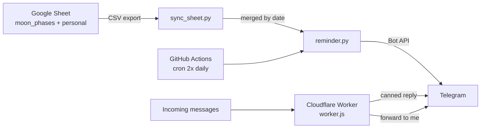

# 🌙 Lunacle

A Telegram bot that tells you what the moon is doing today — and remembers your birthdays while it's at it.

Lunacle sends a daily message about the current lunar phase, eclipses, and the occasional fun fact, mixed in with personal reminders. It runs entirely on free infrastructure: a Google Sheet as the database, GitHub Actions as the scheduler, and a Cloudflare Worker to handle replies. No server, no database, no hosting bill.

**Say hi to it: [@LunacleBot](https://t.me/LunacleBot).**

## What it looks like

> It's Total Lunar eclipse today! It's also a Full Moon day, obviously. 🌝 Fun fact: Today's full moon is called the Worm moon. 🪱

> Today is New Moon day! 🌚 Time is ideal for new beginnings and intentions.

> It's **Friday the 13th!** 👻 Nothing weird going on with the moon today. Stay spooky!

Message the bot as a stranger and Lunacle answers politely, then quietly forwards the conversation to me:

> Hi there! 👋
>
> I can't hold conversations just yet, but I love your enthusiasm! 🌙

## How it works



The project has two halves that don't talk to each other:

**Outbound (scheduled reminders).** A GitHub Actions cron fires twice a day. `sync_sheet.py` pulls two tabs from a Google Sheet, merges them into a date-keyed dict, and drops duplicate messages. `reminder.py` checks today's date in IST and sends anything scheduled to every chat ID in the list.

**Inbound (replies).** `worker.js` sits on a Cloudflare Worker as the Telegram webhook. It matches incoming text against a small table of canned responses, replies, and forwards the message to me — so the bot feels alive to strangers without pretending to be a chatbot.

## Design decisions

**The Google Sheet is the database.** Reminders are content, not code, and content shouldn't need a commit. The sheet is published read-only and fetched through Google's `gviz` CSV endpoint, which means no service account, no OAuth flow, and no credentials to rotate — just a `SHEET_ID`. Editing a reminder is editing a spreadsheet cell from my phone.

**Two tabs, one merge.** `moon_phases` holds the astronomical calendar; `personal` holds birthdays and one-offs. They're separate so the moon data can be regenerated wholesale without touching anything personal. `merge_reminders()` combines them and de-duplicates by message text, so a date appearing in both tabs produces one grouped set of messages rather than two overlapping sends.

**Reminders used to be committed as JSON.** An earlier version ran a sync step that wrote `reminders.json` and committed it back to the repo on every run. That worked, but it filled the history with machine commits and let the data go stale between syncs. Fetching the sheet at send time removed the sync step, the commit step, and a whole class of "did the sync actually run?" failures. The `.gitignore` entry for `reminders.json` is the only trace left.

**Two runs a day is the whole schedule.** A morning message and an evening one is what I actually want from a reminder bot — waking a workflow up every fifteen minutes to support arbitrary times would be a lot of machinery for a preference I don't have. So `time` resolves to the nearest scheduled run instead of being matched to the minute. That also makes the bot immune to GitHub's cron drift: a run that lands at 07:42 still counts as the 07:30 run, where exact matching would have silently sent nothing.

**The moon calendar is written by hand, on purpose.** The first version generated it with [`ephem`](https://rhodesmill.org/pyephem/), which computes lunar phases properly. Two things went wrong. The dates came out slightly off — `ephem` works in UTC, and IST is +5:30, so a phase falling late in the UTC day belongs to the *next* day here, and a bot that announces the full moon on the wrong evening is worse than no bot. And more fundamentally, phase timestamps weren't the data I wanted. "Full moon at 21:14 UTC" isn't a message; "today's full moon is called the Worm moon 🪱" is. Eclipses, the names, Friday the 13th, the small asides — none of that comes out of an ephemeris.

So I dropped the library and filled the sheet in by hand, adding personal reminders in the same pass. It's manual work I'll have to redo each year, and it buys the one thing generation couldn't: every message is something I'd actually want to receive.

**Fetches retry.** Google's CSV endpoint fails intermittently. `fetch_tab()` retries three times with a 5-second backoff before giving up, because a transient blip shouldn't cost a day's reminder.

**Getting off a server took a month and three dead ends.** The first version lived on Railway's trial tier and ran beautifully — right until the trial ended and staying meant paying monthly for a box that sits idle almost every minute of the day. So I went hunting for free compute instead. I compared VPS options, wrestled with Oracle's always-free VM long enough to regret starting, and spent a genuine few minutes considering a Raspberry Pi humming away on my desk to send two messages a day.

Then the obvious thing landed: none of this needs a machine. The reminders are a cron job, and GitHub already runs those for free. The replies are a function that wakes up for a few milliseconds when someone texts and then stops existing. That's precisely what Cloudflare Workers is, and once both halves had somewhere free to run, the hosting problem stopped being a problem — no box to patch, no monthly bill, nothing idling.

**Strangers get a reply, not silence.** The Worker checks whether the sender is me before doing anything. If it isn't, it responds with something warm and forwards the text — so I see what people are asking without the bot ever going quiet on them.

## The sheet

Both tabs share the same three columns:

| Column | Format | Required | Notes |
| --- | --- | --- | --- |
| `date` | `YYYY-MM-DD` | yes | Matched against today's date in IST |
| `message` | text | yes | Telegram HTML is supported — `<b>`, `<i>`, `<a href>` |
| `time` | `HH:MM` (24h) | no | Picks which run it goes out on. Blank means both |

A few representative rows — the first two from `moon_phases`, the third from `personal`:

| date | message | time |
| --- | --- | --- |
| `2026-03-03` | `It's Total Lunar eclipse today! 🌝 Fun fact: today's full moon is called the Worm moon. 🪱` | |
| `2026-03-18` | `Today is New Moon day! 🌚 Time is ideal for new beginnings and intentions.` | `07:30` |
| `2026-03-20` | `<b>Happy birthday!</b> 🌸 🥳` | `18:00` |

Rows missing `date` or `message` are skipped silently.

`time` doesn't schedule an arbitrary moment — the bot only wakes up twice a day, so the column chooses **which of those two runs** a reminder rides along with. Anything you write is snapped to the nearest run: `06:00` or `09:00` go out in the morning, `17:00` or `21:00` in the evening. A time nobody can parse falls back to sending on every run rather than being dropped.

## Configuration

Set as GitHub Actions repository secrets:

| Secret | Description |
| --- | --- |
| `TELEGRAM_TOKEN` | Bot token from [@BotFather](https://t.me/botfather) |
| `TELEGRAM_CHAT_IDS` | Comma-separated chat IDs to send to |
| `SHEET_ID` | The ID from the Google Sheet URL (the sheet must be link-shared) |

`SLOT_TIMES` (optional) overrides the run times the `time` column snaps to — comma-separated IST `HH:MM`, defaulting to `07:30,18:00`. Change it only alongside the cron.

Set as variables on the Cloudflare Worker:

| Variable | Description |
| --- | --- |
| `BOT_TOKEN` | Same bot token |
| `MY_CHAT_IDS` | Comma-separated IDs treated as "me" — these get forwards, not canned replies |
| `WEBHOOK_SECRET` | Shared secret; requests without a matching `X-Telegram-Bot-Api-Secret-Token` header get a 401 |

## Running your own copy

The sheet behind my instance is private, so this isn't a clone-and-run project — you'd need your own bot, your own sheet, and your own chat IDs. Everything it depends on is in the tables above, and the sheet is three columns; there's nothing else to reverse-engineer.

Given those, the scheduled half needs nothing but secrets: push the repo, add the three, and the workflow takes over. To test a send without waiting for the cron, use **Actions → Daily Reminder → Run workflow**.

Locally:

```bash
pip install requests python-telegram-bot pytz
export TELEGRAM_TOKEN="..." TELEGRAM_CHAT_IDS="..." SHEET_ID="..."
python reminder.py
```

The Worker is created and edited in the Cloudflare dashboard — paste `worker.js` into the editor, add the three variables under **Settings → Variables**, deploy, then point Telegram at it:

```bash
curl "https://api.telegram.org/bot<TOKEN>/setWebhook" \
  -d "url=https://<worker>.workers.dev" \
  -d "secret_token=<WEBHOOK_SECRET>"
```

## No message arrived?

In rough order of likelihood:

1. **Read the Actions run log.** Every reminder prints a line — sent, skipped and which run it belongs to, or `No reminder for <date>`. That single log distinguishes "the send failed" from "the row was never due", which are very different problems.
2. **Check the workflow hasn't been disabled.** GitHub switches off scheduled workflows on public repos after 60 days without repository activity, with one email as warning. For a bot that runs on cron and nothing else, this is the most likely reason it goes quiet, and it looks exactly like a code bug from the outside.
3. **Confirm the sheet is still link-shared.** Revoking sharing breaks the CSV fetch — you'll see three retry lines and then a `RuntimeError` in the log.
4. **Check the date format.** `date` is matched as a plain string against `YYYY-MM-DD`. A cell reading `01/03/2026` matches nothing, and the row is skipped without complaint.
5. **Check the chat IDs.** A wrong or stale ID fails for that recipient only, so one person can stop receiving while the other carries on.

## Schedule

| Cron (UTC) | IST |
| --- | --- |
| `0 2 * * *` | 07:30 |
| `30 12 * * *` | 18:00 |

## What it costs

Nothing, and that shaped the design more than anything else.

| Piece | Free tier | What Lunacle uses |
| --- | --- | --- |
| GitHub Actions | Unlimited minutes on public repos | 2 runs/day, ~30s each |
| Cloudflare Workers | 100,000 requests/day | A handful of webhook calls |
| Google Sheets | Free | 2 CSV reads per run |
| Telegram Bot API | Free | A few messages a day |

Every "why not just use a database / a small VPS / a proper scheduler" answer in this repo comes back to staying inside those columns. The sheet is the database because a database costs money and attention. Actions is the scheduler because a cron box would be a machine to maintain. The Worker exists because it's the only free way to answer a webhook the instant it arrives.

## Roadmap

- **Recurring dates.** An `MM-DD` form so a birthday is one row forever instead of one row per year.
- **A moon-calendar generator that drafts rather than decides.** Compute the phases and eclipses in IST and emit rows I'd then rewrite by hand. That keeps the voice I abandoned `ephem` for while removing the yearly data entry, which is the part that will eventually make me stop topping the sheet up.
- **Validation on the sheet.** A malformed date currently does nothing, quietly. A check that flags rows the bot will never fire would catch typos at edit time rather than on a morning when no message shows up.

## Known limitations

- **Reminders can't be set to an arbitrary time.** By design — see above. `time` picks the morning or evening run, and a reminder written for `09:00` arrives at 07:30.
- **`SLOT_TIMES` has to be kept in sync with the cron.** The run times live in `reminder.py` and in `.github/workflows/reminder.yml`, and nothing checks that they agree. Change one, change the other.
- **Reminders are date-exact.** There's no recurrence — an annual birthday needs a row per year.
- **The moon calendar runs out.** It's curated by hand, so the sheet has to be topped up each year. Deliberate, but it does mean the bot goes quiet if I forget.
- **The Worker can't hold a conversation**, and says so. Canned responses match on word boundaries, so a message hitting several triggers gets all of those replies joined together.

## Built with

Python 3.11 · [python-telegram-bot](https://github.com/python-telegram-bot/python-telegram-bot) · GitHub Actions · Cloudflare Workers · Google Sheets

## License

MIT — see [LICENSE](LICENSE).
